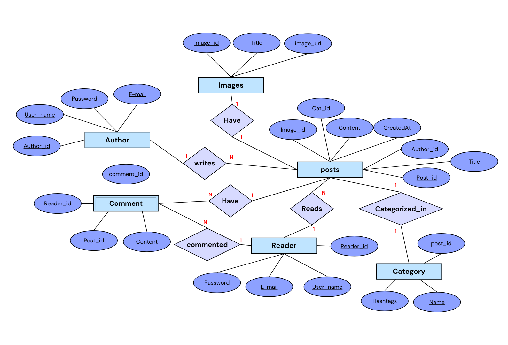
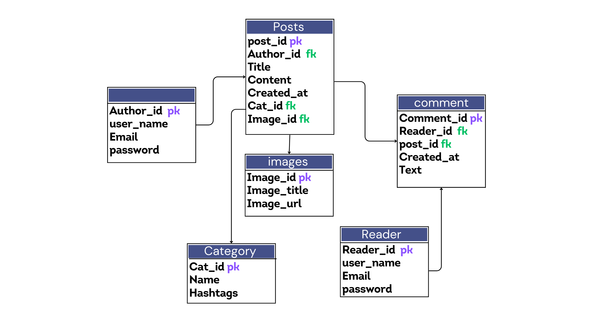

# Blosite (using AI)

This is my DBMS mini project!

## Technology Stack

- Frontend- React, SCSS
- Backend- python(Django)
- Database- SQLite
- API- OpenAI (chatgpt 3.5)

## Tables used in our project

- User
- Blogposts
- Categories
- Images
- Comments

## Frontend

First go to the clinet directory

```bash
  cd client
```

Then install all the node modules

```bash
  npm install
```

Run the react app

```bash
  npm run dev
```

## Backend

Create a virtual environment

```bash
  virtualenv venv
  venv\Script\activate
```

Install all the requirenments

```bash
    pip install -r requirenment.txt
```

Change the directory to Backend

```bash
    cd Backend
```

Apply all the migrations and migrate the database

```bash
    python manage.py makemigrations
    python manage.py migrate
```

Create a admin

```bash
    python manage.py createsuperuser
```

Run the project

```bash
    python manage.py runserver
```

## Installation

Install my-project with npm

```bash
  npm install my-project
  cd my-project
```

## ER Diagram



## Schema Diagram


